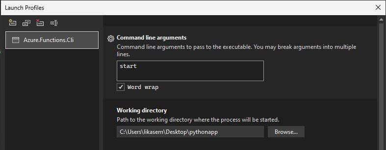

# Guide on debugging Core Tools with the Azure Functions Host

1. Clone the host repo: `azure-functions-host`
2. In `src/Cli/func/Azure.Functions.Cli.csproj`, replace the WebHost package reference with a local project reference:

    Comment out:

   ```xml
   <!-- <PackageReference Include="Microsoft.Azure.WebJobs.Script.WebHost" /> -->
   ```

   Add:

   ```xml
    <ItemGroup>
        <ProjectReference Include="<path to host repo>/src/WebJobs.Script.WebHost/WebJobs.Script.WebHost.csproj" />
    </ItemGroup>
   ```

> [!NOTE]
> You may also need to update the worker package references
> in `eng/build/Packages.props` to match the versions references by the host.

You should now be able to debug the host via the `func start` command in the CLI.

#### VS Code

1. Press `F5`
2. Provide the command you want to run e.g. `start --verbose`
3. Provide the path to your test app, e.g. `<path>/MyTestFuncApp`

This will build the CLI and start the host with the provided command and test app path, and automatically attach the debugger.

#### Visual Studio

1. Open debug launch profiles UI in the Debug tab
2. Set the `Command line arguments` to the command you want to run
3. Set the `Working directory` to the path of your test app
4. Press `F5`



#### Other

You can also run the CLI directly from the repo:

`dotnet run --project src/Cli/func -- start --script-root <path-to-test-app>`

Or, you can also publish the CLI and run via the path:

```bash
# Publish the CLI for your platform
dotnet publish src/Cli/func -r osx-arm64 --sc

# Typically '<path>/out/pub/Azure.Functions.Cli/release_osx-arm64/func'
export FUNC_CLI=<path-to-published-cli>

# Start the host inside the test app directory
$FUNC_CLI start

# Or, you can use an alias instead
alias testfunc="<path-to-published-cli>"
testfunc start
```

Windows:

```pwsh
$env:FUNC_CLI = "<path-to-published-cli>"
& $env:FUNC_CLI start
```