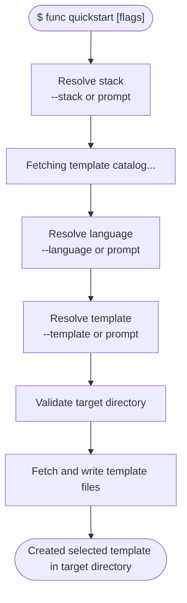
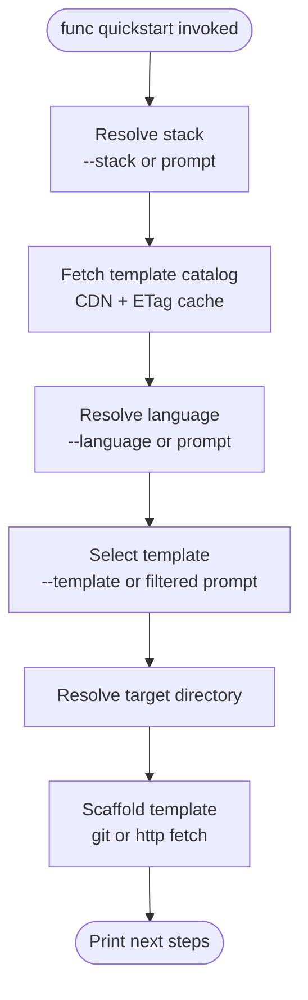
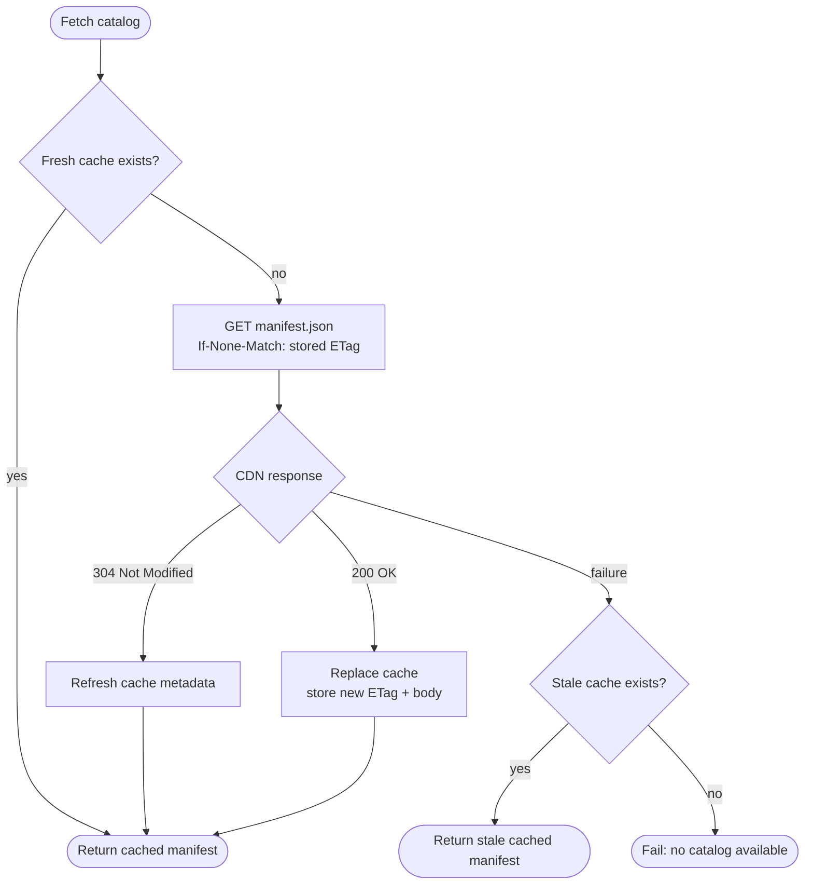
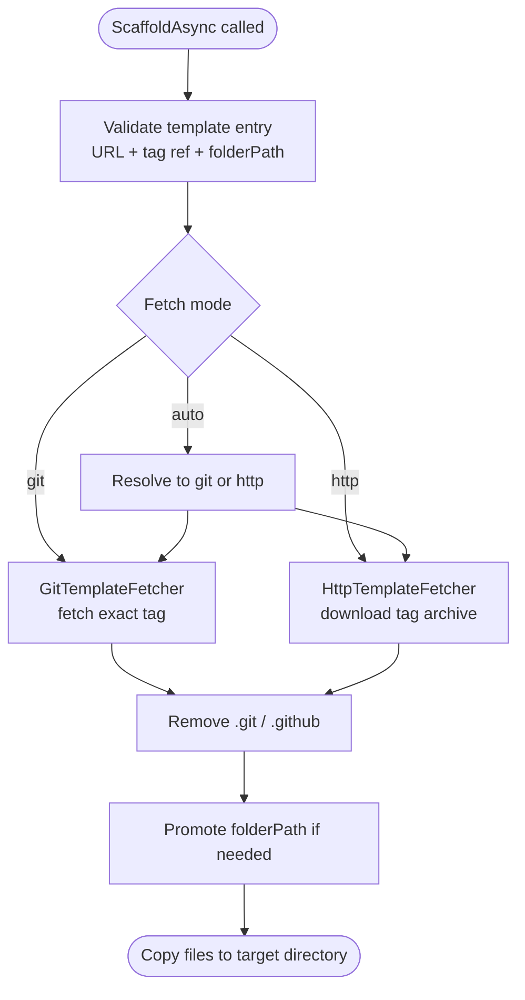

# Core Tools vNext: `func quickstart` — CDN-Backed Template Discovery

**Author:** manvkaur
**Date:** 2026-05-18
**Status:** Draft
**Work Item:** TBD

---

## Command Verb & Terminology Resolution

**Template** is the single noun and concept for this feature. Every user-facing string, design reference, and documentation entry uses "template" — the template catalog, template entries, template scaffolding, etc.

**`quickstart`** is the current command verb (`func quickstart`). This is a transitional name. The CLI already has a use of `templates` surface (templating engine, tokenization, snippets) serving a related but distinct purpose. The long-term intent is to **converge both under a unified `func templates` command** — whole-app scaffolding (currently `func quickstart`) and the existing templating engine would share a single verb with subcommands. The details of that unification are not yet explored; until then, `quickstart` remains the verb to avoid churn during active development.

- Command (current): `func quickstart` → converges into `func templates`
- What gets scaffolded: a **template**
- Collection: the **template catalog**
- Manifest item: a **template entry**

Implementation note: class and interface names use the `Quickstart*` prefix to match the current command verb. These will be renamed alongside the command convergence.

---

## Table of Contents

- [Command Verb & Terminology Resolution](#command-verb--terminology-resolution)
- [Problem Statement](#problem-statement)
- [Goals / Non-Goals](#goals--non-goals)
- [Proposed Design](#proposed-design)
  - [Command Tree](#command-tree)
  - [New Services](#new-services)
    - [IQuickstartManifestService](#iquickstartmanifestservice)
    - [Release & Compliance Model](#release--compliance-model)
    - [Runtime-to-Language Mapping](#runtime-to-language-mapping)
    - [IQuickstartScaffolder](#iquickstartscaffolder)
    - [Download Strategy](#download-strategy---fetch-autogithttp)
    - [Git Process Requirements](#git-process-requirements)
    - [Repository Metadata Cleanup](#repository-metadata-cleanup)
  - [User Experience Flow](#user-experience-flow)
  - [Execution Flow](#execution-flow)
    - [Manifest Cache Flow](#manifest-cache-flow)
    - [Template Download Strategy](#template-download-strategy)
  - [New Commands](#new-commands)
    - [QuickstartCommand](#quickstartcommand)
    - [QuickstartListCommand](#quickstartlistcommand)
    - [QuickstartInfoCommand](#quickstartinfocommand)
  - [BuiltInCommands Change](#builtincommands-change)
  - [File Layout](#file-layout)
- [IInteractionService Prompt Support](#iinteractionservice-prompt-support)
- [Error Messaging](#error-messaging)
- [Security Envelope](#security-envelope)
- [Manifest Source](#manifest-source)
- [Exit Codes](#exit-codes)
- [Future Work](#future-work)
- [Open Questions](#open-questions)
- [Appendix](#appendix)
  - [References](#references)
  - [vnext Architecture](#vnext-architecture-what-already-exists)
  - [fnx init — Source Implementation](#fnx-init--source-implementation)

---

## Problem Statement

In vnext, workload templates solve the per-function scaffolding story: `func new` adds a single function file to an existing project using templates shipped in workload packages. A complementary scenario is **complete-app scaffolding** — downloading a fully runnable function app (function code, host.json, local.settings.json, IaC configuration, and all dependencies) in a single step. Runtime-specific setup (venv, npm install, dotnet restore) is handled separately by the developer or by `func start`.

Today, complete app templates live in GitHub repos (e.g. Azure-Samples) and developers discover them through docs, portal links, or search. This design brings that discovery and scaffolding workflow into the CLI itself.

This design introduces `func quickstart`: a built-in command that downloads **complete, immediately runnable function app templates** directly from GitHub, complementing the workload-driven `func new` experience. Templates are discovered via a live template catalog hosted on the Azure Functions CDN. Adding a new template is as simple as publishing a GitHub repo and adding a template entry to the manifest — no CLI or workload release required. The manifest is versioned independently; the CLI picks up new templates automatically on the next manifest refresh.

How this complements workload templates:

- **Decoupled template lifecycle** — app templates live as standalone GitHub repos; they can be added, updated, and iterated on independently of both CLI and workload package releases
- **Built-in discovery** — `func quickstart list` and the interactive flow give developers a way to find and filter available app templates without leaving the CLI

---

## Goals / Non-Goals

### Goals

- Add `func quickstart` as a top-level command on the vnext branch
- Download and scaffold a **complete function app template** from GitHub — all function code, config, and dependencies included
- CDN-backed template catalog with ETag caching (24h TTL) and stale-cache fallback
- `func quickstart list` — list available templates with `--stack`, `--language`, `--resource`, `--iac`, `--search`, and `--json`
- `func quickstart` (bare invocation) — interactive flow: stack → language (when a stack supports multiple manifest languages) → template → scaffold
- Current stack coverage matches the implementation branch: `.NET`, `Node`, and `Python` providers are registered today; other stacks can participate later by contributing `IQuickstartProvider` implementations
- Agent and CI friendly — `--stack`, `--language`, `--template`, `--fetch`, and `--force` support non-interactive use; `--template` skips template selection once stack/language resolution is complete
- Template download via git tag fetch or GitHub archive download (no bundling in the binary)
- Positional `<path>` target directory support; create it if absent, use it if empty, and allow overwrite with `--force`

### Non-Goals

- Adding a single function file to an existing project (that is v4 `func new` behaviour — out of scope here)
- Replacing or changing `func init` (separate command, workload-driven)
- Changing the workload model or `IProjectInitializer` interface
- Automatic environment setup (venv, npm install, dotnet restore) — out of scope; belongs in a later workflow
- Designing conflict-resolution modes beyond the current `--force` clear-and-scaffold behaviour

> **Why stack/language resolution exists:** `func quickstart` scaffolds into an empty or newly created directory, so it cannot infer the stack from project files. The command resolves the stack from `--stack` or an interactive prompt, then resolves the language from `--language` or a stack-specific prompt when needed.

---

## Proposed Design

> **Terminology:** **template** is the noun everywhere — user-facing strings, docs, and design. `quickstart` is the current command verb, converging to `func templates`. Implementation types use `Quickstart*` until that rename.

### Command Tree

```bash
func quickstart [<path>] [options]          # QuickstartCommand (interactive when bare)
  func quickstart list [options]            # QuickstartListCommand
  func quickstart info <id> [--json]        # QuickstartInfoCommand
```

#### Synopsis

```bash
func quickstart [<path>] [--stack|-s <stack>] [--language|-l <lang>] [--template|-t <id>]
                [--resource|-r <name>] [--iac <name>] [--search <text>]
                [--fetch auto|git|http] [--force]

Subcommands:
  list  [--stack] [--language] [--resource] [--iac] [--search] [--json]
  info  <id> [--json]
```

| Option | Description |
| --- | --- |
| `<path>` | Positional argument: target directory (consistent with `func init`, `func new`, `func start`). Defaults to current directory |
| `--stack`, `-s` | Stack to use (`dotnet`, `node`, `python`). When omitted, the command auto-selects the sole installed provider or prompts interactively |
| `--language`, `-l` | Programming language within the selected stack (`csharp`, `javascript`, `typescript`, `python`) |
| `--template`, `-t` | Template id from the manifest — skips template selection |
| `--resource`, `-r` | Filter by trigger/binding resource (`http`, `timer`, `blob`, `eventhub`, `servicebus`, `cosmos`, `sql`, `mcp`, `durable`) |
| `--iac` | Filter by infrastructure-as-code type (`bicep`, `terraform`, `none`) |
| `--search` | Case-insensitive substring filter applied to ids, template names, resource type, infrastructure-as-code type, and descriptions |
| `--fetch` | Controls how template payload is fetched: `auto` (default), `git`, `http` |
| `--force` | Clears the target directory (except `.git`) before scaffolding |
| `--json` | Available on `list` and `info` for machine-readable output |

> **Thin-command design** — `QuickstartCommand` is a thin shell. All business logic lives in `IQuickstartManifestService`, `IQuickstartScaffolder`, and `IQuickstartProviderResolver`; no catalog, scaffolding, or stack/language resolution logic lives in the command itself.

**User experience:**

```bash
# Interactive scaffold — stack is chosen first
$ func quickstart

  Select a stack:
    .NET
    Node
    Python

  # Node currently exposes two manifest languages, so it prompts next:
  Select a language:
    TypeScript
    JavaScript

  Select a template:
    HTTP Trigger (TypeScript + AZD + Bicep)
    Blob EventGrid Trigger (TypeScript + AZD + Bicep)
    ...

  Created http-trigger-typescript-azd in current directory

# Scaffold into a named folder (created if it doesn't exist)
$ func quickstart ./my-new-api

# Non-interactive scaffold by exact template id
$ func quickstart ./my-fn --stack python --language python --template http-trigger-python-azd

# Directory is not empty → error
$ func quickstart ./existing-dir --stack python --language python --template http-trigger-python-azd
  Error: The target directory is not empty. Pass --force to overwrite, or choose a different path.

# Overwrite an existing directory
$ func quickstart ./existing-dir --stack python --language python --template http-trigger-python-azd --force
```

**Post-scaffold success banner:**

Every successful scaffold prints a success line followed by runtime-specific next steps. When a positional `<path>` is supplied, step 1 is `cd <path>`. When scaffolding into the current directory, the `cd` step is omitted and remaining steps are renumbered.

| Stack / Language | Next Steps |
| --- | --- |
| Python | `pip install -r requirements.txt`, verify `local.settings.json`, `func run` |
| TypeScript | `npm install`, verify `local.settings.json`, `func run` |
| JavaScript | `npm install`, verify `local.settings.json`, `func run` |
| .NET / C# | verify `local.settings.json`, `func run` |

```bash
# Filter by stack
$ func quickstart list --stack python

  ID                             Name                  Description
  ----------------------------------------------------------------
  http-trigger-python-azd        HTTP Trigger          Python Azure Function with an HttpTrigger.
  timer-trigger-python-azd       Timer Trigger         Python Azure Function with a TimerTrigger.
  ...

# Filter by stack + language + keyword
$ func quickstart list --stack node --language typescript --search blob

# JSON output for automation
$ func quickstart list --stack python --json

# Non-interactive scaffold by exact template id
$ func quickstart ./my-fn --stack python --language python --template http-trigger-python-azd

# Show detailed info about a specific template
$ func quickstart info http-trigger-python-azd

  HTTP Trigger

  ID:        http-trigger-python-azd
  Language:  Python
  Resource:  http
  IaC:       bicep
  Git Ref:   refs/tags/v1.0.0
  Repo:      https://github.com/Azure-Samples/functions-quickstart-python-http-azd
  Path:      .
```

---

### New Services

#### `IQuickstartManifestService`

```csharp
// src/Abstractions/Quickstart/IQuickstartManifestService.cs
public interface IQuickstartManifestService
{
    public Task<QuickstartManifest> GetManifestAsync(CancellationToken cancellationToken = default);
}
```

`QuickstartManifestService` implementation:

| Behaviour | Detail |
| ----------- | -------- |
| Primary URL | `https://cdn.functions.azure.com/public/templates-manifest/manifest.json` |
| Cache location | `~/.azure-functions/quickstart/manifest.json` + `~/.azure-functions/quickstart/manifest-meta.json` |
| Cache key | ETag from the CDN response |
| TTL | 24 hours |
| Fresh cache | Return the cached manifest without a network call |
| Stale cache | Revalidate with `If-None-Match`; on `304`, refresh cache metadata and keep the cached body |
| Network / parse failure | Use a stale cached manifest if available; otherwise fail |
| Trusted-org filter | Drop any template entry whose `repositoryUrl` owner is not in `{"azure", "azure-samples", "microsoft"}` |
| Manifest validation | Drop entries missing required fields (`id`, `displayName`, `language`, `resource`, `repositoryUrl`, `folderPath`, `gitRef`) |
| `gitRef` policy | Only tag refs are accepted: `refs/tags/*` |
| Override | `FUNC_QUICKSTART_MANIFEST_URL` overrides the primary source. Accepts an `https://` URL, a `file://` URI, or an absolute local file path |
| Serialization | `QuickstartManifestEnvelope` + `QuickstartJsonContext` handle JSON parsing |

#### Release & Compliance Model

The manifest source of truth lives in the [`Azure/azure-functions-templates`](https://github.com/Azure/azure-functions-templates) repository under `Functions.Templates/Template-Manifest/`.

| Aspect | Detail |
| --- | --- |
| Source repo | `Azure/azure-functions-templates` — manifest changes require a PR and team approval |
| Immutability | Every template entry pins a `gitRef` (tag or commit SHA). No branch references allowed — content is frozen at a reviewed point-in-time |
| Staging | Staging CDN at `https://cdn-staging.functions.azure.com/staging/templates-manifest/manifest.json`. Used for pre-release validation. CLI can target it via `FUNC_QUICKSTART_MANIFEST_URL` |
| Production | Production CDN at `https://cdn.functions.azure.com/public/templates-manifest/manifest.json`. Updated only after staging validation passes |
| Promotion flow | PR merged → CI validates schema + smoke-tests each template's `gitRef` is resolvable → published to staging → manual promotion to production |
| Testing locally | Set `FUNC_QUICKSTART_MANIFEST_URL=file:///path/to/local/manifest.json` or point to staging CDN; schema must match |

#### Runtime-to-Language Mapping

The command resolves a **stack** first, then resolves a manifest `language` within that stack.

| Stack prompt / `--stack` | `--language` value(s) | Manifest `language` | Notes |
| --- | --- | --- | --- |
| `.NET` / `dotnet` | `csharp` | `CSharp` | Current implementation exposes C# templates via `DotNetQuickstartProvider` |
| `Node` / `node` | `typescript` | `TypeScript` | Node templates can prompt between TypeScript and JavaScript when both are present |
| `Node` / `node` | `javascript` | `JavaScript` | Direct flag bypasses the language prompt |
| `Python` / `python` | `python` | `Python` | Single-language provider; auto-selects when stack is resolved |

When a stack has only one available manifest language, the command auto-selects it. When a stack has multiple available languages, interactive mode prompts and non-interactive mode requires `--language`.

#### `IQuickstartScaffolder`

```csharp
// src/Abstractions/Quickstart/IQuickstartScaffolder.cs
public interface IQuickstartScaffolder
{
    public Task ScaffoldAsync(
        QuickstartEntry entry,
        string targetDirectory,
        FetchMode fetchMode,
        CancellationToken cancellationToken = default);
}
```

`QuickstartScaffolder` implementation:

- No `ScaffoldResult` type exists in the current implementation; `ScaffoldAsync` returns `Task` and signals failures via exceptions.
- `QuickstartScaffolder` validates the template entry, resolves the effective `FetchMode`, delegates to an `ITemplateFetcher`, removes repo metadata, promotes `folderPath` when needed, and copies files into the target directory.

#### Download Strategy (`--fetch auto|git|http`)

| Value | Implementation | Behaviour |
| --- | --- | --- |
| `auto` **(default)** | `IFetchModeResolver` / `FetchModeResolver` | Probe for git; use `git` when available, otherwise `http` |
| `git` | `GitTemplateFetcher` | `git init` + `remote add` + explicit tag fetch + detached checkout; verifies tag integrity |
| `http` | `HttpTemplateFetcher` | Download `https://github.com/<owner>/<repo>/archive/<gitRef>.zip`, extract, then unwrap the archive root |

#### Download Details

| Concern | Detail |
| ---------- | -------- |
| Whole-template fetch | Both fetchers download the repository at the pinned tag, then `QuickstartScaffolder` promotes `folderPath` if the template lives in a subfolder |
| Fetch mode resolution | `auto` chooses once up front; explicit `git` and `http` do not silently switch modes |
| Metadata cleanup | Remove `.git/` and `.github/` after fetch |
| Target copy | Copy extracted files into the target directory after validation and subfolder promotion |
| Trusted repo policy | Repository URL must be `https://github.com/...` and belong to an allowed organization |
| Tag policy | `gitRef` must be `refs/tags/*`; branch refs are rejected |

#### Git Process Requirements

All git child-process invocations must satisfy:

| Requirement | Implementation |
| --- | --- |
| **Process abstraction** | Wrap behind `IGitRunner` / `GitRunner`; tests use `FakeGitRunner` |
| **Argument-array invocation** | Pass arguments via `ProcessStartInfo.ArgumentList`, never a shell-concatenated string |
| **Exact tag fetch** | Fetch the explicit tag refspec; do not rely on branch names or default branches |
| **Tag integrity** | Verify the ref is an annotated tag and that the checked-out commit matches the tag target |
| **Non-interactive** | Disable all credential prompts |
| **Timeout / cancellation** | Honour the command `CancellationToken` and kill the process tree on cancellation |

#### Repository Metadata Cleanup

After any successful fetch, the scaffolder removes:

- `<target>/.git/` -- never useful for a fresh template project
- `<target>/.github/` -- CI workflows belong to the source repo, not the user's project

Read-only attributes (set by git on Windows for pack files) are cleared before deletion.

---

### User Experience Flow

What the user sees in the terminal across every path.



---

### Execution Flow



#### Manifest Cache Flow



#### Template Download Strategy



---

### New Commands

#### `QuickstartCommand`

> **Thin-command principle** — `QuickstartCommand` must not contain catalog, scaffolding, or stack/language-resolution logic itself. All of that lives in `IQuickstartManifestService`, `IQuickstartScaffolder`, and `IQuickstartProviderResolver`.

```csharp
// src/Func/Commands/Quickstart/QuickstartCommand.cs
internal sealed class QuickstartCommand : FuncCliCommand
{
    public Option<string?> StackOption { get; } = new("--stack", "-s")
    {
        Description = QuickstartMessages.StackOptionDescription
    };

    public Option<string?> LanguageOption { get; } = new("--language", "-l")
    {
        Description = "The programming language"
    };

    public Option<string?> TemplateOption { get; } = new("--template", "-t")
    {
        Description = "Template ID from the manifest (e.g. http-trigger-python-azd) — skips template selection prompts"
    };

    public Option<bool> ForceOption { get; } = new("--force")
    {
        Description = "Scaffolds even when the target folder isn't empty. Clears the folder (except .git) before scaffolding."
    };

    public QuickstartCommand(
        QuickstartListCommand listCommand,
        QuickstartInfoCommand infoCommand,
        IInteractionService interaction,
        IQuickstartProviderResolver resolver,
        IQuickstartManifestService manifestService,
        IQuickstartScaffolder scaffolder,
        IEnumerable<IQuickstartProvider> providers)
        : base("quickstart", "Browse and scaffold complete function apps from the Azure Functions template catalog.")
    {
        AddPathArgument();
        Subcommands.Add(listCommand);
        Subcommands.Add(infoCommand);
        // ... store services and add options
    }
}
```

#### `QuickstartListCommand`

```csharp
// src/Func/Commands/Quickstart/QuickstartListCommand.cs
internal sealed class QuickstartListCommand : FuncCliCommand
{
    public Option<string?> StackOption { get; } = new("--stack", "-s");
    public Option<string?> LanguageOption { get; } = new("--language", "-l");
    public Option<string?> ResourceOption { get; } = new("--resource", "-r");
    public Option<string?> IacOption { get; } = new("--iac");
    public Option<string?> SearchOption { get; } = new("--search");
    public Option<bool> JsonOption { get; } = new("--json");

    protected override async Task<int> ExecuteAsync(ParseResult parseResult, CancellationToken cancellationToken)
    {
        // 1. Resolve stack → provider
        // 2. Fetch catalog via IQuickstartManifestService
        // 3. Resolve language via IQuickstartProviderResolver
        // 4. Filter QuickstartManifest entries and render a table or JSON
    }
}
```

#### `QuickstartInfoCommand`

```csharp
// src/Func/Commands/Quickstart/QuickstartInfoCommand.cs
internal sealed class QuickstartInfoCommand : FuncCliCommand
{
    public Argument<string> TemplateIdArgument { get; } = new("id")
    {
        Description = "Template ID from the manifest (e.g. http-trigger-python-azd). Use 'func quickstart list' to see available IDs."
    };

    public Option<bool> JsonOption { get; } = new("--json")
    {
        Description = "Emit machine-readable JSON instead of formatted output."
    };

    protected override async Task<int> ExecuteAsync(ParseResult parseResult, CancellationToken cancellationToken)
    {
        // 1. Fetch catalog
        // 2. Find the matching QuickstartEntry by id
        // 3. Use IQuickstartProviderResolver to map manifest language to display language
        // 4. Render formatted output or JSON
    }
}
```

---

### `BuiltInCommands` Change

```csharp
// src/Func/Hosting/BuiltInCommands.cs
services.AddSingleton<FuncCliCommand, QuickstartCommand>();
services.AddSingleton<QuickstartListCommand>();
services.AddSingleton<QuickstartInfoCommand>();
```

Quickstart services are registered outside `BuiltInCommands` in the host composition root:

```csharp
// src/Func/Hosting/CliHostFactory.cs
builder.Services.AddQuickstartScaffolder();
builder.Services.AddQuickstartManifest();
```

Stack-specific providers are registered by workloads, not by `BuiltInCommands`:

```csharp
builder.Services.AddSingleton<IQuickstartProvider, DotNetQuickstartProvider>();
builder.Services.AddSingleton<IQuickstartProvider, NodeQuickstartProvider>();
builder.Services.AddSingleton<IQuickstartProvider, PythonQuickstartProvider>();
```

---

### File Layout

```text
src/
  Abstractions/
    Quickstart/
      FetchMode.cs
      IQuickstartManifestService.cs
      IQuickstartProvider.cs
      IQuickstartScaffolder.cs
      QuickstartConstants.cs
      QuickstartEntry.cs
      QuickstartManifest.cs
  Func/
    Commands/
      Quickstart/
        QuickstartCommand.cs
        QuickstartInfoCommand.cs
        QuickstartListCommand.cs
        QuickstartMessages.cs
    Hosting/
      BuiltInCommands.cs
    Quickstart/
      FetchModeResolver.cs
      GitRunner.cs
      GitRunnerException.cs
      GitTemplateFetcher.cs
      HttpTemplateFetcher.cs
      IFetchModeResolver.cs
      IGitRunner.cs
      IManifestCache.cs
      IQuickstartProviderResolver.cs
      ITemplateFetcher.cs
      ManifestCache.cs
      ManifestCacheMeta.cs
      QuickstartJsonContext.cs
      QuickstartManifestEnvelope.cs
      QuickstartManifestOptions.cs
      QuickstartManifestService.cs
      QuickstartProviderResolver.cs
      QuickstartRegistration.cs
      QuickstartScaffolder.cs
      QuickstartScaffolderRegistration.cs
      QuickstartUrlValidator.cs
  Workloads/
    Stacks/
      DotNet/
        DotNetQuickstartProvider.cs
      Node/
        NodeQuickstartProvider.cs
      Python/
        PythonQuickstartProvider.cs

test/Func.Tests/
  Commands/
    Quickstart/
      QuickstartCommandTests.cs
      QuickstartInfoCommandTests.cs
      QuickstartListCommandTests.cs
      QuickstartTestHelpers.cs
  Quickstart/
    FakeGitRunner.cs
    HttpTemplateFetcherTests.cs
    QuickstartManifestServiceTests.cs
    QuickstartManifestTests.cs
    QuickstartScaffolderTests.cs
    QuickstartUrlValidatorTests.cs
```

---

## `IInteractionService` Prompt Support

`IInteractionService` now includes selection-prompt methods added during the quickstart handler work (PR 4):

```csharp
Task<string> PromptForSelectionAsync(string title, IEnumerable<string> choices, CancellationToken cancellationToken = default);
Task<IReadOnlyList<string>> PromptForMultiSelectionAsync(string title, IEnumerable<string> choices, CancellationToken cancellationToken = default);
Task<string> PromptForInputAsync(string prompt, string? defaultValue = null, CancellationToken cancellationToken = default);
```

The `SpectreInteractionService` implementation backs these with `Spectre.Console.SelectionPrompt<T>` with `EnableSearch()`, giving the user:

- **Arrow keys** (↑↓) to move through the list
- **Type any character** to live-filter the visible items; backspace to clear
- Both work simultaneously — filter then navigate within the filtered set

Respects `IsInteractive` (falls back to numbered list in CI/non-TTY).

**Why this matters vs. v4 `func new`:** The current stable CLI uses raw `Console.ReadKey()` arrow navigation which hangs or crashes in agent, CI, and piped contexts because there is no TTY. The `IInteractionService.IsInteractive` check ensures the new design degrades gracefully: in a non-TTY context the prompt renders as a numbered list that accepts stdin, and when all flags are supplied no prompt is shown at all.

> **Note on `--search` vs. in-prompt search:** These are complementary. `--search blob` on `func quickstart` pre-filters the list *before* the prompt is shown (useful for scripting or reducing noise when you already know the keyword). The `EnableSearch()` interactive filter lets users type to narrow down after the prompt appears. Both apply the same case-insensitive substring matching over template metadata.

---

## Error Messaging

The implementation centralises shared user-facing strings in `QuickstartMessages.cs`.

| Constant | Value | Used for |
| --- | --- | --- |
| `FetchingCatalogStatus` | `Fetching template catalog...` | Status spinner while the catalog is loading |
| `TemplateNotFoundHint` | `Run 'func quickstart list' to see available templates.` | Hint appended when a template id is missing |
| `DirectoryNotEmptyError` | `The target directory is not empty. Pass --force to overwrite, or choose a different path.` | Error before scaffolding into a non-empty directory |
| `CancelledHint` | `Quickstart cancelled. The directory was not modified.` | Hint shown when an interactive `--force` confirmation is declined |
| `NoMatchingFiltersError` | `No templates match the specified filters. Run 'func quickstart list' to see all available templates, or adjust --resource, --iac, or --search.` | `func quickstart` error after filtering |
| `MultipleMatchesError` | `Multiple templates match. Re-run with --template <id> to select one, or add filters (--resource, --iac, --search) to narrow the results.` | `func quickstart` error when filters still produce multiple matches |
| `NoMatchingFiltersWarning` | `No templates match the specified filters.` | `func quickstart list` warning |

### Exception Strategy

Following the Core Tools vnext error handling convention:

- **Services** (`QuickstartManifestService`, `QuickstartScaffolder`) throw specific framework/domain exceptions at the failure site.
- **Commands** (`QuickstartCommand`, `QuickstartListCommand`, `QuickstartInfoCommand`) are the boundary. Each catches the specific exceptions it expects from its direct service calls and wraps them in `GracefulException(message, isUserError: true)`, preserving the inner exception. The `try` is narrow — one service call per `try` block.
- **Anything unexpected** is not caught by the command — it surfaces as an unhandled exception with a stack trace (runtime bug).

---

## Security Envelope

| Concern | Mitigation |
| --- | --- |
| Malicious manifest entry pointing to attacker repo | URL allow-list: HTTPS scheme + `github.com` host + trusted org (`azure`, `azure-samples`, `microsoft`). Filtered in manifest client, re-checked in scaffolder |
| Zip slip / path traversal in archive | Every entry's resolved absolute path must start with `Path.GetFullPath(targetPath)` + `DirectorySeparator`. Mismatch -> `InvalidOperationException` |
| Flag injection via manifest values | Argv-array invocation + `--` end-of-options sentinel + reject `gitRef`/`folderPath` starting with `-` |
| Command-line injection via folderPath | `..` segments rejected |
| Interactive git credential prompts hanging the CLI | Four env vars set to disable every prompt path (see Git Process Requirements) |
| Runaway git process | 60s timeout with process-tree kill |

**Trusted GitHub organizations** -- hard-coded allow-list in `QuickstartUrlValidator`:

- `azure`
- `azure-samples`
- `microsoft`

---

## Manifest Source

| Aspect | Detail |
| --- | --- |
| Primary | `https://cdn.functions.azure.com/public/templates-manifest/manifest.json` |
| Override | `FUNC_QUICKSTART_MANIFEST_URL` env var — accepts an `https://` URL, a `file://` URI, or an absolute local file path |
| Cache directory | `~/.azure-functions/quickstart/` |
| Caching | ETag-based, with a 24-hour TTL and stale-cache fallback |
| Entry policy | Template entries must be tag-pinned (`refs/tags/*`) before they are eligible for scaffolding |

The implementation reads the CDN manifest by default, honours a local or staging override via `FUNC_QUICKSTART_MANIFEST_URL`, and falls back only to the local cache when the network path is unavailable.

---

## Exit Codes

| Code | Condition |
| --- | --- |
| 0 | Successful scaffold / list / info |
| 1 | User error (graceful): unknown template, non-empty target, empty filter result, manifest fetch failure, `--fetch git` with git missing, git/http fetch failure |
| Non-zero (uncaught) | Unexpected runtime bug -- stack trace surfaces |

---

## Future Work

- **GPG tag verification** -- when the manifest moves to `gitRef`-pinned entries and Azure-Samples/trusted orgs begin GPG-signing release tags, add an optional `git verify-tag` step. Default-on once signing is reliable; needs UX for unsigned/invalid, GPG-not-installed handling, public-key bundling or trust-on-first-use. Both `gitRef` enforcement and GPG verification become active together -- one without the other provides no guarantee.

---

## Open Questions

- [ ] **Default language** — today the command auto-selects a language when the chosen stack has a single manifest language, and requires `--language` or an interactive prompt when the stack has multiple languages. Should there still be a persisted or inferred default for repeat users? Options:
  - **Detect from existing files** — run `ProjectDetector.DetectStackAndLanguage(targetDir)` on the resolved target before prompting; if detectable files exist (e.g. `requirements.txt`, `package.json`, `*.csproj`), use the detected language as the default; if target is empty, fall through to prompt or error. Already exists at `src/Func/Commands/ProjectDetector.cs`. This becomes more useful now that `--force` can clear an existing target directory before scaffolding.
  - **Persist last-used language** — store in `~/.azure-functions/<verb>/preferences.json` after first scaffold; use as default on next run
  - **Explicit `func config set default-language <lang>`** — user opts in deliberately; no implicit magic
  - **Keep required** — simplest; interactive prompt is low friction anyway; scripts always supply it
  - Consider: does a persisted or detected default interact badly with non-TTY/CI (wrong language silently used)? Detection from files is safer than persistence — it's scoped to the target dir, not global state.
- [ ] **`--search` empty-result behaviour in interactive mode** — when the in-prompt Spectre filter (not the `--search` flag) narrows to zero results, Spectre renders an empty list. Should the command detect this and show a message, or let the user backspace to widen the filter naturally?
- [ ] **`func quickstart` vs `func new` interactive fallback** — should bare `func new` (when no workloads installed) redirect to `func quickstart` interactive flow, rather than showing a hint? Or keep the hint to encourage workload installation?
- [ ] **`--output json` on `func quickstart list`** — useful for tooling. Worth adding now or later?

---

## Appendix

### References

- `fnx init` orchestration: `func-emulate/fnx/lib/init.js` (internal)
- Manifest fetch + cache: `func-emulate/fnx/lib/init/manifest.js` (internal)
- Scaffold (git + zip): `func-emulate/fnx/lib/init/scaffold.js` (internal)
- Interactive prompts: `func-emulate/fnx/lib/init/prompts.js` (internal)
- Runtime + trigger constants: `func-emulate/fnx/templates-mcp/src/templates.ts` (internal)
- vnext `NewCommand`: `src/Func/Commands/NewCommand.cs`
- vnext `WorkloadCommand` (pattern): `src/Func/Commands/Workload/WorkloadCommand.cs`
- vnext `IInteractionService`: `src/Func/Console/IInteractionService.cs`

### vnext Architecture (What Already Exists)

The vnext branch has been rebuilt from scratch on System.CommandLine. Key elements relevant to this design:

| Type | Location | Role |
| --- | --- | --- |
| `FuncCliCommand` | `src/Func/Commands/FuncCliCommand.cs` | Base class for all commands. Subcommands injected via constructor. |
| `IBuiltInCommand` | `src/Func/Hosting/IBuiltInCommand.cs` | Marker interface — names are reserved, registered in `BuiltInCommands` |
| `NewCommand` | `src/Func/Commands/NewCommand.cs` | `func new` — delegates to workloads for per-function scaffolding |
| `IInteractionService` | `src/Func/Console/IInteractionService.cs` | Spectre.Console abstraction. Has `IsInteractive`, `WriteTable`, `ShowStatusAsync`, prompt methods. |
| `IQuickstartManifestService` | `src/Abstractions/Quickstart/IQuickstartManifestService.cs` | Fetches and caches the template catalog. |
| `IQuickstartScaffolder` | `src/Abstractions/Quickstart/IQuickstartScaffolder.cs` | Downloads and writes a selected template into the target directory. |
| `IQuickstartProviderResolver` | `src/Func/Quickstart/IQuickstartProviderResolver.cs` | Resolves stack and language selection across installed providers. |
| `IQuickstartProvider` | `src/Abstractions/Quickstart/IQuickstartProvider.cs` | Stack contribution point for quickstart participation. |
| `BuiltInCommands` | `src/Func/Hosting/BuiltInCommands.cs` | Registers all built-in commands with DI |
| `WorkloadCommand` | `src/Func/Commands/Workload/WorkloadCommand.cs` | Pattern reference — parent command with subcommands injected via constructor |
| `WorkloadListCommand` | `src/Func/Commands/Workload/WorkloadListCommand.cs` | Pattern reference — subcommand using `IInteractionService.WriteTable` |

**`WorkloadCommand` pattern** (to follow exactly):

- Parent command receives subcommands via constructor, calls `Subcommands.Add()`
- Each subcommand registered as its own concrete singleton in `BuiltInCommands`, **not** as `FuncCliCommand` (to prevent top-level registration)
- Parent registered as `FuncCliCommand` so it appears at top level

### fnx init — Source Implementation

| Component | Location | Role |
| --- | --- | --- |
| **Init orchestration** | `fnx/lib/init.js` | 9-step flow: manifest → prompts → download → scaffold |
| **Manifest fetching** | `fnx/lib/init/manifest.js` | CDN fetch, ETag caching, 24h TTL, bundled fallback |
| **Interactive prompts** | `fnx/lib/init/prompts.js` | Arrow-key selection via readline raw mode; numbered fallback for CI |
| **Scaffolding** | `fnx/lib/init/scaffold.js` | Historical source inspiration for template download and safety checks; the current implementation uses `GitTemplateFetcher` and `HttpTemplateFetcher` |
| **Template definitions** | `fnx/templates-mcp/src/templates.ts` | `SUPPORTED_RUNTIMES`, trigger priority list, `TemplateParameter` |

**`fnx init` flow (condensed):**

1. Fetch manifest from `https://cdn.functions.azure.com/public/templates-manifest/manifest.json` (ETag-cached; bundled fallback on failure)
2. Prompt: **runtime** (Python / Node.js / .NET / Java / PowerShell)
3. For Node.js: prompt **language** (TypeScript / JavaScript)
4. Filter manifest by runtime → prompt **trigger** (priority-sorted: HTTP, Blob, Timer, Queue, …)
5. Prompt **project name**
6. Download template: `git clone --sparse` (if git available) else GitHub zip API
7. Generate `host.json`, `local.settings.json`, `.gitignore`; print success banner

**Security primitives to port:**

- `safePath(targetDir, fileName)` — resolve + prefix check to prevent path traversal
- `filterTrustedTemplates()` — allowlist of `azure`, `azure-samples`, `microsoft` GitHub orgs
- URL scheme validation before any network call
