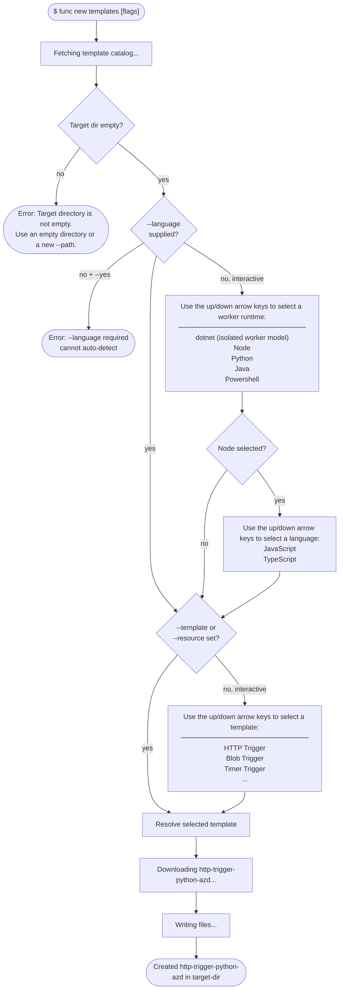
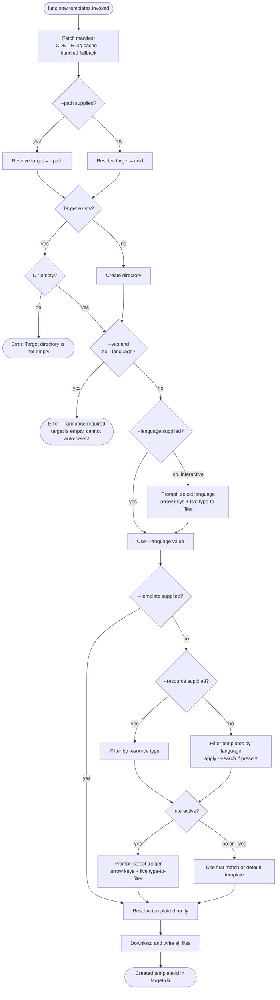
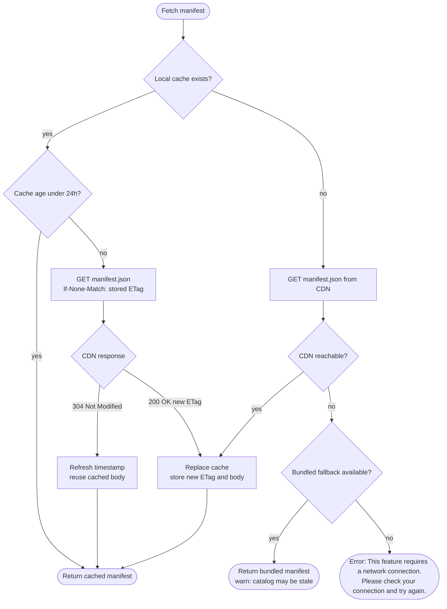
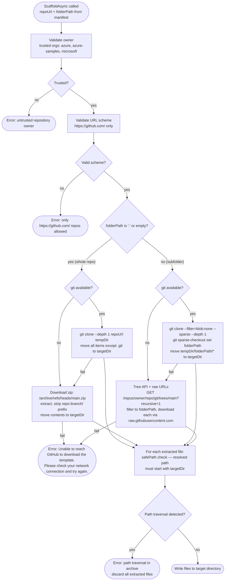

# Core Tools vNext: `func new templates` — CDN-Backed Template Discovery

**Author:** manvkaur
**Date:** 2026-05-18
**Status:** Draft
**Work Item:** TBD

---

## Table of Contents

- [Problem Statement](#problem-statement)
- [Goals / Non-Goals](#goals--non-goals)
- [Proposed Design](#proposed-design)
  - [Command Tree](#command-tree)
  - [New Services](#new-services)
    - [ITemplateManifestService](#itemplatemanifestservice)
    - [Runtime-to-Language Mapping](#runtime-to-language-mapping)
    - [ITemplateFunctionScaffolder](#itemplatefunctionscaffolder)
  - [User Experience Flow](#user-experience-flow)
  - [Execution Flow](#execution-flow)
    - [Manifest Cache Flow](#manifest-cache-flow)
    - [Template Download Strategy](#template-download-strategy)
  - [New Commands](#new-commands)
    - [TemplatesCommand](#templatescommand)
    - [TemplatesListCommand](#templateslistcommand)
    - [TemplatesInfoCommand](#templatesinfocommand)
  - [NewCommand Change](#newcommand-change)
  - [BuiltInCommands Change](#builtincommands-change)
  - [File Layout](#file-layout)
- [IInteractionService Prompt Gap](#iinteractionservice-prompt-gap)
- [Error Messaging](#error-messaging)
- [Incremental: `--env` Flag](#incremental---env-flag)
- [Open Questions](#open-questions)
- [Appendix](#appendix)
  - [References](#references)
  - [vnext Architecture](#vnext-architecture-what-already-exists)
  - [fnx init — Source Implementation](#fnx-init--source-implementation)

---

## Problem Statement

Today's function app templates are scattered across multiple sources — the CLI binary, extension bundle, VS Code extension, and Maven repository — each shipping on its own cadence. Getting a template in front of a developer requires a coordinated release across several of these channels, with a minimum turnaround of 6–8 weeks from merge to broad availability. Templates are also bundled inside the CLI binary itself, meaning every addition or update requires a full CLI release.

This design introduces `func new templates`: a command that downloads **complete, immediately runnable function app templates** directly from GitHub. Templates are discovered via a live manifest hosted on the Azure Functions CDN. Adding a new template is as simple as publishing a GitHub repo and adding an entry to the manifest — no CLI release required. The manifest is versioned independently; the CLI picks up new templates automatically on the next manifest refresh.

Three pain points this solves:

- **Release cycle friction** — new templates are available as soon as the manifest is updated, not after a 6–8 week CLI release cycle
- **Maintenance burden** — templates live as standalone GitHub repos, not embedded in the CLI binary; they can be updated, PR'd, and iterated on independently
- **Scaffolding gap in vnext** — the vnext `func new` stub exits with code 1 if no workload is installed; `func new templates` gives developers a working template experience from a clean install, no workload required

---

## Goals / Non-Goals

### Goals

- Add `func new templates` as a built-in subcommand of `NewCommand` on the vnext branch
- Download and create a **complete, runnable function app** from a GitHub template — all function code, config, and dependencies included; `func start` works immediately after scaffolding
- CDN-backed template manifest with ETag caching (24h TTL)
- `func new templates list` — non-interactive table of available templates, filterable by `--language`, `--resource`, `--iac`, and keyword (`--search`); `--search` is a **case-insensitive substring match** (not semantic/fuzzy) against `id`, `displayName`, `resource`, `tags`, and `shortDescription`
- `func new templates` (bare invocation) — interactive flow: worker runtime → (Node sub-prompt: JS/TS) → trigger → scaffold; the runtime prompt matches the existing `func new` UX (`dotnet (isolated worker model)`, `Node`, `Python`, `Java`, `Powershell`); trigger selection supports incremental keyword filtering; powered by the existing `IInteractionService` / Spectre.Console already in vnext
- **.NET isolated worker model only** — the manifest `CSharp` language maps exclusively to the .NET isolated worker model; the in-process model is not supported and will not be added (it is on a deprecation path)
- **Agent and CI friendly** — all v4 `func new` flags preserved (`--language`, `--template`); `--language` accepts runtime names (`python`, `node`, `java`, `dotnet-isolated`, `javascript`, `typescript`, `powershell`); `--yes` accepts remaining defaults non-interactively but errors clearly if `--language` is not supplied; non-TTY falls back to numbered list
- Template download via git sparse-checkout or GitHub zip API (no bundling in binary)
- `--path` to specify target directory (absolute or relative); created if absent, accepted if it exists and is empty — error if it exists and is not empty

### Non-Goals

- Adding a single function file to an existing project (that is v4 `func new` behaviour — out of scope here)
- Replacing or changing `func init` (separate command, workload-driven)
- Changing the workload model or `IProjectInitializer` interface
- Automatic environment setup (venv, npm install, dotnet restore) — **deferred to `--env` incremental** (see [Incremental: `--env` Flag](#incremental---env-flag))
- File conflict handling and `--force` flag — **deferred to next iteration of this command**; v1 requires target directory to be empty

> **Key difference from v4 `func new`:** v4 adds a single function file into an *existing* project. `func new templates` downloads a complete, runnable function app from a GitHub template — function code, host.json, local.settings.json, .gitignore, and all dependencies — into a target directory. `func start` works immediately. This is why `--language` is required with no auto-detect fallback (target is assumed empty before scaffolding).

---

## Proposed Design

> **Command keyword note:** `templates` is the current choice for the subcommand name (`func new templates`). If the command is later promoted to top-level, this name becomes the top-level verb — the right name should be confirmed during design review before vNext ships.

### Command Tree

```bash
func new                                    # NewCommand (existing)
  func new templates                        # TemplatesCommand (new — interactive flow when bare)
    func new templates list                 # TemplatesListCommand (new — table output)
    func new templates info <id>            # TemplatesInfoCommand (new — detailed template info)
```

> **Promotion path** — `TemplatesCommand` is designed to be re-parented as a top-level command (`func <newcommand>`) with zero logic changes. All business logic lives in `ITemplateManifestService` and `ITemplateFunctionScaffolder`; the command is a thin shell. When/if promoted:
>
> - Change registration in `BuiltInCommands` from `services.AddSingleton<TemplatesCommand>()` to `services.AddSingleton<FuncCliCommand, TemplatesCommand>()`  
> - Remove `Subcommands.Add(templatesCommand)` from `NewCommand`  
> - No changes to services, scaffolding, prompts, or tests

**User experience:**

```bash
# Interactive scaffold — arrow keys to navigate, type to live-filter
$ func new templates

  Use the up/down arrow keys to select a worker runtime:
    dotnet (isolated worker model)
    Node
    Python
    Java
    Powershell

  # User picks Node → sub-prompt for language:
  Use the up/down arrow keys to select a language:
    JavaScript
    TypeScript

  # User types "bl" — list narrows live as they type, arrow keys still work:
  Use the up/down arrow keys to select a template: bl
    Blob EventGrid Trigger (TypeScript + AZD + Bicep)

  # User clears search, navigates with arrows:
  Use the up/down arrow keys to select a template:
    HTTP Trigger (TypeScript + AZD + Bicep)
    Timer Trigger (TypeScript + AZD + Bicep)
    Blob EventGrid Trigger (TypeScript + AZD + Bicep)
    ...

  Created http-trigger-typescript-azd in current directory

  Next steps:
    1. npm install
    2. npm run build
    3. func start

# Interactive scaffold into a named folder (created if it doesn't exist)
$ func new templates --path ./my-new-api

  Use the up/down arrow keys to select a worker runtime: ...

  # (after selection)
  Created <selected-template> in ./my-new-api

  Next steps:
    1. cd ./my-new-api
    2. <runtime-specific install>
    3. func start

# Scaffold into a specific folder (created if absent; also accepted if it exists and is empty)
$ func new templates --template blob-eventgrid-trigger-python-azd --path ./my-fn
$ func new templates --template blob-eventgrid-trigger-python-azd --path /home/user/projects/my-fn

# Directory is not empty → error
$ func new templates --template http-trigger-python-azd --path ./existing-dir
  Error: Target directory './existing-dir' is not empty.
  Use an empty directory or a new --path.

# Network failure — CDN unreachable (manifest fetch)
$ func new templates
  Error: This feature requires a network connection to fetch the template catalog.
  Please check your connection and try again.

# Network failure — GitHub unreachable (template download)
$ func new templates --template http-trigger-python-azd
  Error: Unable to reach GitHub to download the template.
  Please check your network connection and try again.

# --yes requires --language (target is empty — nothing to detect from)
$ func new templates --language python --yes
  Created http-trigger-python-azd in current directory

  Next steps:
    1. python -m venv .venv
    2. .venv\Scripts\activate      # macOS/Linux: source .venv/bin/activate
    3. pip install -r requirements.txt
    4. func start

# --yes without --language → clear error:
# Error: --language is required. Target directory is empty; cannot auto-detect language.
```

**Post-scaffold success banner:**

Every successful scaffold prints a success line followed by runtime-specific next steps. When `--path` is supplied, step 1 is `cd <path>`. When scaffolding into the current directory, the `cd` step is omitted and remaining steps are renumbered.

| Runtime | Next Steps |
| --- | --- |
| Python | `python -m venv .venv`, `.venv\Scripts\activate` (Windows) or `source .venv/bin/activate` (macOS/Linux), `pip install -r requirements.txt`, `func start` — the CLI detects the platform and shows the correct activation command |
| TypeScript | `npm install`, `npm run build`, `func start` |
| JavaScript | `npm install`, `func start` |
| .NET (isolated) | `dotnet restore`, `func start` |
| Java | `mvn clean package`, `func start` |
| PowerShell | `func start` (no dependency step) |

```bash
# Filter by language — Language column omitted (redundant)
$ func new templates list --language python

  Id                                        Resource    IaC
  ────────────────────────────────────────────────────────
  http-trigger-python-azd                   http        bicep
  timer-trigger-python-azd                  timer       bicep
  blob-eventgrid-trigger-python-azd         blob        bicep
  eventhub-trigger-python-azd               eventhub    bicep
  servicebus-trigger-python-azd             servicebus  bicep
  ...

# Filter by resource — Resource column omitted (redundant)
$ func new templates list --resource http

  Id                                        Language    IaC
  ────────────────────────────────────────────────────────
  http-trigger-csharp-azd                   CSharp      bicep
  http-trigger-python-azd                   Python      bicep
  http-trigger-typescript-azd               TypeScript  bicep
  http-trigger-javascript-azd               JavaScript  bicep
  ...

# Filter by iac — IaC column omitted (redundant)
$ func new templates list --iac bicep

  Id                                        Resource    Language
  ────────────────────────────────────────────────────────────
  http-trigger-csharp-azd                   http        CSharp
  timer-trigger-python-azd                  timer       Python
  ...

# Keyword search — all columns shown (no filter to omit)
$ func new templates list --search blob

  Id                                          Resource    Language    IaC
  ────────────────────────────────────────────────────────────────────────
  blob-eventgrid-trigger-csharp-azd           blob        CSharp      bicep
  blob-eventgrid-trigger-python-azd           blob        Python      bicep
  blob-eventgrid-trigger-typescript-azd       blob        TypeScript  bicep
  ...

# Combined — Language and Resource columns omitted
$ func new templates list --language python --resource blob

# Non-interactive scaffold with language + resource
$ func new templates --language python --resource http

# Non-interactive scaffold with language + resource + iac
$ func new templates --language python --resource http --iac bicep

# Non-interactive scaffold by exact template id (skips language + trigger prompts)
$ func new templates --template http-trigger-python-azd

# Show detailed info about a specific template
$ func new templates info http-trigger-python-azd

  HTTP Trigger (Python + AZD + Bicep)

  Python Azure Function with an HttpTrigger. Runs on Flex Consumption plan
  with managed identity authentication and VNet integration for secure
  networking. Infrastructure provisioned with Bicep and deployed with azd.

  Language:    Python
  Resource:    http
  IaC:         bicep
  Repository:  https://github.com/Azure-Samples/functions-quickstart-python-http-azd

  What's included:
    - HTTP trigger function
    - Bicep infrastructure files
    - Azure Developer CLI (azd) configuration
    - VNet integration setup
    - VS Code debug configuration
    - Local development configuration
```

---

### New Services

#### `ITemplateManifestService`

```csharp
// src/Func/Templates/ITemplateManifestService.cs
internal interface ITemplateManifestService
{
    Task<TemplateManifest> GetManifestAsync(CancellationToken cancellationToken = default);
}
```

`TemplateManifestService` implementation (ported from `fnx/lib/init/manifest.js`):

| Behaviour | Detail |
| ----------- | -------- |
| Primary URL | `https://cdn.functions.azure.com/public/templates-manifest/manifest.json` |
| Backup URL | `https://raw.githubusercontent.com/Azure/azure-functions-templates/dev/Functions.Templates/Template-Manifest/manifest.json` |
| Cache location | `~/.azure-functions-core-tools/cache/manifest.json` + `manifest-meta.json` |
| Cache key | ETag from CDN response |
| TTL | 24 hours (refresh ETag check on expiry) |
| 304 Not Modified | Update TTL timestamp, return cached manifest |
| Network failure | Log warning via `IInteractionService.WriteWarning`; fall back to bundled embedded manifest |
| Trusted-org filter | Strip any template whose `repositoryUrl` owner is not in `{"azure", "azure-samples", "microsoft"}` |
| IaC-only filter | Exclude templates where `language` is `ARM`, `Bicep`, or `Terraform` — these are infrastructure-as-code templates, not function app code. The manifest has 4 such entries (e.g. `iac-flex-consumption-bicep`); they are irrelevant to `func new templates`. |
| Manifest validation | Non-null `templates` array; each entry has `id`, `language`, `resource`, `repositoryUrl`, `folderPath` |

#### Runtime-to-Language Mapping

The interactive prompt shows **worker runtimes** (matching `func new` UX), but the manifest uses a `language` field. The mapping between prompt labels, `--language` flag values, and manifest `language` values:

| Prompt Label | `--language` flag value(s) | Manifest `language` | Notes |
| --- | --- | --- | --- |
| dotnet (isolated worker model) | `dotnet-isolated`, `dotnet`, `csharp` | `CSharp` | Isolated worker model only — in-process is deprecated and not supported |
| Node | `node` | — | Sub-prompt: JavaScript or TypeScript |
| — | `javascript` | `JavaScript` | Direct flag bypasses Node sub-prompt |
| — | `typescript` | `TypeScript` | Direct flag bypasses Node sub-prompt |
| Python | `python` | `Python` | |
| Java | `java` | `Java` | |
| Powershell | `powershell` | `PowerShell` | |

**Node sub-prompt:** When the user selects "Node" in the interactive runtime prompt, a follow-up prompt asks for JavaScript or TypeScript. When `--language node` is supplied non-interactively, the default is TypeScript (matching the modern v4 programming model). Use `--language javascript` or `--language typescript` to skip the sub-prompt entirely.

#### `ITemplateFunctionScaffolder`

```csharp
// src/Func/Templates/ITemplateFunctionScaffolder.cs
internal interface ITemplateFunctionScaffolder
{
    Task<ScaffoldResult> ScaffoldAsync(
        TemplateEntry template,
        string targetDirectory,
        CancellationToken cancellationToken = default);
}
```

`TemplateFunctionScaffolder` implementation (ported from `fnx/lib/init/scaffold.js`):

| Strategy | Condition | Detail |
| ---------- | ----------- | -------- |
| git sparse-checkout | `git` available on PATH | `git clone --filter=blob:none --sparse <repoUrl>` then `git sparse-checkout set <folderPath>` |
| Tree API + raw URLs | No git (subfolder) | One API call to `GET /repos/{owner}/{repo}/git/trees/main?recursive=1` (60 req/hr) to enumerate files, then download each via `raw.githubusercontent.com` (~5,000 req/hr). Tree response capped at 5 MB and cached. |
| GitHub zip API | No git (whole repo) | `GET https://api.github.com/repos/<owner>/<repo>/zipball/<ref>` → extract and strip `repo-main/` prefix |
| Path traversal prevention | Always | Resolve each extracted path and assert it starts with `targetDirectory + Path.DirectorySeparatorChar` |
| Trusted org | Always | Validate `owner` from `repositoryUrl` before any network call |
| URL scheme | Always | Only `https://github.com/` allowed as repository base |

---

### User Experience Flow

What the user sees in the terminal across every path.



---

### Execution Flow



#### Manifest Cache Flow



#### Template Download Strategy

`folderPath` from the manifest determines what to download. When `folderPath` is `"."` or empty, the entire repo is the template. When it specifies a subfolder (e.g. `templates/python/BlobTrigger`), only that subtree is downloaded.



**Fallback chain**: git → zip/API → error. Each strategy falls back to the next if it fails (git not installed, sparse-checkout unsupported, zip download fails).

| `folderPath` | Git available | Strategy | What's downloaded |
| --- | --- | --- | --- |
| `"."` or empty | yes | `git clone --depth 1` | Entire repo (minus `.git`) |
| `"."` or empty | no | GitHub zip (`/archive/refs/heads/main.zip`) | Entire repo, strip `repo-main/` prefix |
| `"src/templates/python"` | yes | Sparse checkout | Only `folderPath` subtree |
| `"src/templates/python"` | no | Tree API + raw URLs | 1 API call for tree listing, then raw URL per file (~5,000 req/hr) |

> **Why Tree API + raw URLs instead of Contents API:** The GitHub Contents API costs 1 API call per file and has a 60 req/hr unauthenticated limit — a template with 20 files would burn a third of the budget. The Tree API enumerates the full repo in a single API call (cached 12h). Individual files are then fetched from `raw.githubusercontent.com` which has a separate, much higher rate limit (~5,000 req/hr). This matches the approach used in [microsoft/mcp#2071](https://github.com/microsoft/mcp/pull/2071).
>
> **Rate limit detection:** GitHub returns HTTP 403 (not 429) when rate-limited. We distinguish rate limiting from permission errors by checking `X-RateLimit-Remaining: 0`. The `X-RateLimit-Reset` header provides the reset timestamp. Tree responses are capped at 5 MB (`MaxTreeSizeBytes`) to prevent OOM.

---

### New Commands

#### `TemplatesCommand`

> **Thin-command principle** — `TemplatesCommand` must not contain any manifest, scaffolding, or prompt logic itself. All of that lives in `ITemplateManifestService` and `ITemplateFunctionScaffolder`. This keeps the command re-parentable: it can live under `func new` today and be promoted to `func <newcommand>` later by changing one DI registration, not the implementation.

```csharp
// src/Func/Commands/New/TemplatesCommand.cs
internal sealed class TemplatesCommand : FuncCliCommand
{
    // Carried forward from v4 func new — preserve agent/CI compatibility
    public Option<string?> LanguageOption { get; } = new("--language", "-l")
    {
        Description = "Worker runtime or language (e.g. python, node, java, dotnet-isolated, javascript, typescript)"
    };
    public Option<string?> TemplateOption { get; } = new("--template", "-t")
    {
        Description = "Template id from the manifest (e.g. http-trigger-python-azd) — skips language and trigger selection"
    };

    // New in vnext
    public Option<string?> PathOption { get; } = new("--path")
    {
        Description = "Target directory for the new project; accepts absolute or relative path. Created if absent, accepted if it exists and is empty."
    };
    // --force deferred to future iteration; v1 requires empty target directory
    public Option<string?> ResourceOption { get; } = new("--resource", "-r")
    {
        Description = "Filter by trigger/binding resource (e.g. http, timer, blob, eventhub, servicebus, cosmos, sql, mcp, durable)"
    };
    public Option<string?> IacOption { get; } = new("--iac")
    {
        Description = "Filter by IaC type (e.g. bicep, none)"
    };
    public Option<string?> SearchOption { get; } = new("--search", "-s")
    {
        Description = "Case-insensitive substring filter applied to trigger names and descriptions before prompting (not semantic/fuzzy search)"
    };
    public Option<bool> YesOption { get; } = new("--yes", "-y")
    {
        Description = "Accept all defaults non-interactively. Requires --language (no auto-detect; target folder is empty)."
    };

    public TemplatesCommand(
        TemplatesListCommand listCommand,
        TemplatesInfoCommand infoCommand,
        ITemplateManifestService manifestService,
        ITemplateFunctionScaffolder scaffolder,
        IInteractionService interaction)
        : base("templates", "Browse and scaffold functions from the Azure Functions template catalog.")
    {
        Subcommands.Add(listCommand);
        Subcommands.Add(infoCommand);
        // ... store services
    }

    protected override async Task<int> ExecuteAsync(ParseResult parseResult, CancellationToken cancellationToken)
    {
        // Runtime/language resolution:
        //   → if --language missing in non-interactive/--yes mode: fail with clear error
        //   → if --language missing in interactive mode: prompt "Use the up/down arrow keys to select a worker runtime:"
        //     showing: dotnet (isolated), dotnet (in-process), Node, Python, Java, Powershell
        //   → if user selects "Node": sub-prompt for JavaScript vs TypeScript
        //   → map prompt selection to manifest `language` value (see Runtime-to-Language Mapping)
        //   → if --language supplied directly: map flag value to manifest language
        //     (e.g. "python" → "Python", "node" → sub-prompt or default TypeScript with --yes)
        // Directory resolution:
        //   target = --path (absolute or relative) if supplied, else cwd
        //   if target does not exist: create it
        //   if target exists and is empty: use it as-is
        //   if target exists and is not empty: error (v1 — --force deferred to future iteration)
        // Non-interactive path: --template supplied → resolve by id, scaffold directly
        // --template supplied → skip both language and trigger selection
        // --yes path: skip trigger prompt; errors if --language not supplied
        // Interactive path: prompt via IInteractionService for missing runtime/trigger
        // 1. Fetch manifest (verbose logging for cache hit/miss/refresh)
        //    manifest automatically excludes IaC-only templates (ARM, Bicep, Terraform)
        // 2. Prompt worker runtime (if not --language) → IInteractionService.PromptSelectionAsync
        //    If Node selected → sub-prompt for JavaScript vs TypeScript
        // 3. If --template: resolve by id directly; else filter by language + --search, prompt trigger
        //    In interactive mode: PromptSelectionAsync uses Spectre SearchEnabled=true so
        //    the user can also type to narrow the trigger list without a flag
        // 4. ScaffoldAsync → log completion and exit
    }
}
```

#### `TemplatesListCommand`

```csharp
// src/Func/Commands/New/TemplatesListCommand.cs
internal sealed class TemplatesListCommand : FuncCliCommand
{
    public Option<string?> LanguageOption { get; } = new("--language", "-l")
    {
        Description = "Filter by worker runtime or language (e.g. python, node, java, dotnet-isolated)"
    };
    public Option<string?> ResourceOption { get; } = new("--resource", "-r")
    {
        Description = "Filter by trigger/binding resource (e.g. http, timer, blob, eventhub, servicebus, cosmos, sql, mcp, durable)"
    };
    public Option<string?> IacOption { get; } = new("--iac")
    {
        Description = "Filter by IaC type (e.g. bicep, none)"
    };
    public Option<string?> SearchOption { get; } = new("--search", "-s")
    {
        Description = "Case-insensitive substring match against displayName, id, resource, tags, and shortDescription (not semantic/fuzzy)"
    };

    protected override async Task<int> ExecuteAsync(ParseResult parseResult, CancellationToken cancellationToken)
    {
        // 1. Fetch manifest (ShowStatusAsync for spinner)
        //    IaC-only templates (ARM, Bicep, Terraform) already excluded by service
        // 2. Map --language flag value to manifest language(s) via Runtime-to-Language Mapping
        //    "node" → filter to both JavaScript and TypeScript
        // 3. Filter by --resource: exact match on resource field (case-insensitive)
        // 4. Filter by --iac: exact match on iac field (case-insensitive)
        // 5. Filter by --search: case-insensitive substring match on displayName, id, resource, tags, shortDescription
        //    if zero results after all filters: error "No templates found matching '<query>'..." exit 1
        // 6. Sort by priority (ascending — lower priority value = higher in list)
        // 7. Build column set: always include Id; omit Language if --language supplied, omit Resource if --resource supplied, omit IaC if --iac supplied
        // 8. WriteTable(columns, rows)
    }
}
```

#### `TemplatesInfoCommand`

```csharp
// src/Func/Commands/New/TemplatesInfoCommand.cs
internal sealed class TemplatesInfoCommand : FuncCliCommand
{
    public Argument<string> TemplateIdArgument { get; } = new("id")
    {
        Description = "Template id from the manifest (e.g. http-trigger-python-azd). Use 'func new templates list' to see available ids."
    };

    protected override async Task<int> ExecuteAsync(ParseResult parseResult, CancellationToken cancellationToken)
    {
        // 1. Fetch manifest
        // 2. Find template by id (case-insensitive match)
        // 3. If not found: error with suggestion to run 'func new templates list'
        // 4. Display detailed info:
        //    - displayName
        //    - longDescription (or shortDescription fallback)
        //    - language, resource, iac
        //    - repositoryUrl
        //    - whatsIncluded (bulleted list)
    }
}
```

---

### `NewCommand` Change

`NewCommand` gains `TemplatesCommand` as a constructor-injected subcommand:

```csharp
// BEFORE
public NewCommand(IWorkloadHintRenderer hintRenderer) : base("new", "...") { ... }

// AFTER
public NewCommand(IWorkloadHintRenderer hintRenderer, TemplatesCommand templatesCommand)
    : base("new", "Create a new function from a template.")
{
    Subcommands.Add(templatesCommand);
    // existing options unchanged
}
```

---

### `BuiltInCommands` Change

```csharp
// Existing pattern (WorkloadCommand):
services.AddSingleton<WorkloadListCommand>();
services.AddSingleton<WorkloadInstallCommand>();
services.AddSingleton<WorkloadUninstallCommand>();
services.AddSingleton<FuncCliCommand, WorkloadCommand>();

// New (TemplatesCommand, same pattern):
services.AddSingleton<TemplatesListCommand>();
services.AddSingleton<TemplatesInfoCommand>();
services.AddSingleton<TemplatesCommand>();          // not as FuncCliCommand — it's a subcommand
services.AddSingleton<ITemplateManifestService, TemplateManifestService>();
services.AddSingleton<ITemplateFunctionScaffolder, TemplateFunctionScaffolder>();
// NewCommand's registration already exists; it now also resolves TemplatesCommand via DI
```

---

### File Layout

```text
src/Func/
  Commands/
    New/
      TemplatesCommand.cs         ← new
      TemplatesListCommand.cs     ← new
      TemplatesInfoCommand.cs     ← new
    NewCommand.cs                 ← modified (add TemplatesCommand subcommand)
  Templates/
    ITemplateManifestService.cs   ← new
    TemplateManifestService.cs    ← new
    ITemplateFunctionScaffolder.cs ← new
    TemplateFunctionScaffolder.cs  ← new
    TemplateManifest.cs           ← new (model)
    TemplateEntry.cs              ← new (model)
    ScaffoldResult.cs             ← new (model)
  Hosting/
    BuiltInCommands.cs            ← modified (register new services + commands)

test/Func.Tests/
  Commands/New/
    TemplatesCommandTests.cs      ← new
    TemplatesListCommandTests.cs  ← new
    TemplatesInfoCommandTests.cs  ← new
  Templates/
    TemplateManifestServiceTests.cs ← new
    TemplateFunctionScaffolderTests.cs ← new
```

---

## `IInteractionService` Prompt Gap

The current `IInteractionService` in vnext (`src/Func/Console/IInteractionService.cs`) does not yet have a selection-prompt method. `TemplatesCommand`'s interactive path needs one. Two options:

1. **Extend `IInteractionService`** — add `Task<T> PromptSelectionAsync<T>(string title, IEnumerable<(T value, string label)> options, CancellationToken ct)`. Backed by `Spectre.Console.SelectionPrompt<T>` with `SearchEnabled = true` in `SpectreInteractionService`, which gives the user:
   - **Arrow keys** (↑↓) to move through the list
   - **Type any character** to live-filter the visible items; backspace to clear
   - Both work simultaneously — filter then navigate within the filtered set
   - No additional code needed; this is standard Spectre.Console behaviour

   Respects `IsInteractive` (falls back to numbered list in CI/non-TTY).

   **Why this matters vs. v4 `func new`:** The current stable CLI uses raw `Console.ReadKey()` arrow navigation which hangs or crashes in agent, CI, and piped contexts because there is no TTY. The `IInteractionService.IsInteractive` check ensures the new design degrades gracefully: in a non-TTY context the prompt renders as a numbered list that accepts stdin, and when all flags are supplied no prompt is shown at all.

2. **Use `IAnsiConsole` directly in `TemplatesCommand`** — inject `Spectre.Console.IAnsiConsole` alongside `IInteractionService` as an escape hatch.

**Preferred: Option 1** — keeps all TUI calls behind `IInteractionService`. This makes `TemplatesCommand` fully testable with a substituted `IInteractionService` (NSubstitute). `SearchEnabled = true` on `SelectionPrompt<T>` is a one-liner in the Spectre implementation and directly serves the in-prompt filter UX.

> **Note on `--search` vs. in-prompt search:** These are complementary. `--search blob` on `func new templates` pre-filters the list *before* the prompt is shown (useful for scripting or reducing noise when you already know the keyword). The `SearchEnabled` interactive filter lets users type to narrow down after the prompt appears. Both apply the same case-insensitive substring match on template id, trigger name, and description.

---

## Error Messaging

All user-facing errors are surfaced as `GracefulException` (caught by `Program.Main` and printed cleanly with exit code 1). Internal/unexpected failures propagate as unhandled exceptions with a stack trace.

| Category | Condition | Error Message | When Shown |
| ---------- | ----------- | --------------- | ------------ |
| **Network — manifest** | CDN returns non-2xx/304 or request times out | `This feature requires a network connection to fetch the template catalog. Please check your connection and try again.` | Any command (`templates`, `list`, `info`) when the CDN is unreachable **and** no cached/bundled manifest is available |
| **Network — manifest (degraded)** | CDN fails but a cached or bundled manifest exists | *(warning, not error)* `Unable to refresh the template catalog — using cached data.` | Same as above, but a stale manifest was found; command continues with stale data |
| **Network — download** | GitHub returns non-2xx, times out, or `git clone` fails with network error | `Unable to reach GitHub to download the template. Please check your network connection and try again.` | `templates` (scaffold) after template selection, when the download step fails |
| **GitHub rate limit** | Tree API returns 403 with `X-RateLimit-Remaining: 0`, or 429 | `GitHub API rate limit exceeded. Rate limit resets at <HH:mm:ss UTC>. Try again later.` | `templates` (scaffold) during Tree API call for subfolder templates |
| **Template not found** | `--template <id>` does not match any entry in the manifest | `Template '<id>' not found. Run 'func new templates list' to see available templates.` | `templates --template <id>` or `info <id>` |
| **Language required** | `--yes` supplied without `--language` | `--language is required. Target directory is empty; cannot auto-detect language.` | `templates --yes` (non-interactive mode with no language) |
| **No templates for language** | `--language` value is valid but no manifest templates match | `No templates found for language '<lang>'.` | `templates --language <lang>` or `list --language <lang>` |
| **Invalid language** | `--language` value doesn't map to any known runtime | `Unknown language '<value>'. Valid values: dotnet-isolated, node, javascript, typescript, python, java, powershell.` | Any command that accepts `--language` |
| **No search results** | `--search` filter (or combined `--language`/`--resource`/`--iac` filters) produces zero matching templates | `No templates found matching '<query>'. Run 'func new templates list' to see all available templates.` | `templates` and `templates list` after filtering |
| **Directory not empty** | Target directory contains any files or subdirectories | `Target directory '<path>' is not empty. Use an empty directory or a new --path.` | `templates` (scaffold) before download, during directory validation |
| **Untrusted org** | Template's `repositoryUrl` owner is not in the trusted-org allowlist (`azure`, `azure-samples`, `microsoft`) | `Template references an untrusted repository (<owner>/<repo>). This template cannot be downloaded.` | `templates` (scaffold) before any network call to GitHub |
| **Path traversal** | An extracted file resolves outside the target directory | `Path traversal detected in template archive: <filename>. The template may be corrupted or malicious.` | `templates` (scaffold) during file extraction from staging to target |
| **Target is a file** | `--path` points to an existing file (not a directory) | `'<path>' is a file, not a directory. --path must be a directory.` | `templates --path <path>` |
| **Permission denied** | Cannot write to the target directory | `Permission denied: cannot write to '<path>'. Check directory permissions.` | `templates` (scaffold) when file copy fails with `UnauthorizedAccessException` |
| **Git sparse-checkout failed** | `git` is on PATH but sparse-checkout fails (non-network) | Falls through to Tree API + raw URL fallback; no user-visible error unless that also fails | `templates` (scaffold) — transparent fallback |
| **Manifest parse error** | CDN returns 200 but the body is not valid JSON or is missing required fields | `The template catalog is corrupted or has an unexpected format. Try again later, or file an issue.` | Any command, after manifest fetch |

### Exception Strategy

Following the Core Tools vnext error handling convention:

- **Services** (`TemplateManifestService`, `TemplateFunctionScaffolder`) throw specific framework/domain exceptions at the failure site:
  - `HttpRequestException` — network failures
  - `FileNotFoundException` / `DirectoryNotFoundException` — missing paths
  - `UnauthorizedAccessException` — permission issues
  - `InvalidOperationException` — untrusted org in manifest, path traversal, parse errors
  - `KeyNotFoundException` — template id not found

- **Commands** (`TemplatesCommand`, `TemplatesListCommand`, `TemplatesInfoCommand`) are the boundary. Each catches the specific exceptions it expects from its direct service calls and wraps them in `GracefulException(message, isUserError: true)`, preserving the inner exception. The `try` is narrow — one service call per `try` block.

- **Anything unexpected** is not caught by the command — it surfaces as an unhandled exception with a stack trace (runtime bug).

---

## Incremental: `--env` Flag

> **Status:** Deferred — not in v1 scope. Tracked as a follow-up after the core `func new templates` command.

The `--env` flag would automatically set up the runtime environment after scaffolding, so `func start` works without any manual steps.

**What `--env` does per runtime:**

| Runtime | Actions | Detects |
| --- | --- | --- |
| Python | `python -m venv .venv`, activate venv, `pip install -r requirements.txt` | `requirements.txt` in template |
| TypeScript | `npm install`, `npm run build` | `package.json` + `tsconfig.json` in template |
| JavaScript | `npm install` | `package.json` in template |
| .NET (isolated) | `dotnet restore` | `*.csproj` in template |
| Java | `mvn clean package` | `pom.xml` in template |
| PowerShell | *(no-op — no dependency install needed)* | — |

**UX with `--env`:**

```bash
$ func new templates --language python --template http-trigger-python-azd --env

  Downloading http-trigger-python-azd...
  Creating virtual environment (.venv)...
  Installing dependencies (pip install -r requirements.txt)...

  Created http-trigger-python-azd in current directory

  Next steps:
    1. func start
```

When `--env` succeeds, the post-scaffold banner drops all install/activate steps — the environment is ready, so only `cd` (if `--path` was used) and `func start` remain. If `--env` partially fails (e.g. `pip install` fails), the banner falls back to showing the full manual steps with a warning that automatic setup was incomplete.

---

## Open Questions

- [ ] **Default language** — `--language` is currently required with no fallback (target dir is empty, nothing to detect from). Should there be a default so repeat users don't have to supply it every time? Options:
  - **Detect from existing files** — run `ProjectDetector.DetectStackAndLanguage(targetDir)` on the resolved target before prompting; if detectable files exist (e.g. `requirements.txt`, `package.json`, `*.csproj`), use the detected language as the default; if target is empty, fall through to prompt or error. Already exists at `src/Func/Commands/ProjectDetector.cs`. Becomes more useful when `--force` is added in a future iteration (target dir may have project files).
  - **Persist last-used language** — store in `~/.azure-functions-core-tools/config` after first scaffold; use as default on next run
  - **Explicit `func config set default-language <lang>`** — user opts in deliberately; no implicit magic
  - **Keep required** — simplest; interactive prompt is low friction anyway; scripts always supply it
  - Consider: does a persisted or detected default interact badly with `--yes` in CI (wrong language silently used)? Detection from files is safer than persistence — it's scoped to the target dir, not global state.
- [ ] **`--search` empty-result behaviour in interactive mode** — when the in-prompt Spectre filter (not the `--search` flag) narrows to zero results, Spectre renders an empty list. Should the command detect this and show a message, or let the user backspace to widen the filter naturally?
- [ ] **`func new templates` vs `func new` interactive fallback** — should bare `func new` (when no workloads installed) redirect to `func new templates` interactive flow, rather than showing a hint? Or keep the hint to encourage workload installation?
- [ ] **`--output json` on `func new templates list`** — useful for tooling. Worth adding now or later?
- [ ] **Top-level command name** — If/when `TemplatesCommand` is promoted, what is the verb? Candidates: `func scaffold`, `func template`, `func create`. Decide before vNext ships so the subcommand name (`templates`) is chosen with the promotion in mind.

---

## Appendix

### References

- `fnx init` orchestration: [func-emulate/fnx/lib/init.js](../../../repos/func-emulate/fnx/lib/init.js)
- Manifest fetch + cache: [func-emulate/fnx/lib/init/manifest.js](../../../repos/func-emulate/fnx/lib/init/manifest.js)
- Scaffold (git + zip): [func-emulate/fnx/lib/init/scaffold.js](../../../repos/func-emulate/fnx/lib/init/scaffold.js)
- Interactive prompts: [func-emulate/fnx/lib/init/prompts.js](../../../repos/func-emulate/fnx/lib/init/prompts.js)
- Runtime + trigger constants: [func-emulate/fnx/templates-mcp/src/templates.ts](../../../repos/func-emulate/fnx/templates-mcp/src/templates.ts)
- vnext `NewCommand`: [azure-functions-core-tools/src/Func/Commands/NewCommand.cs](../../../repos/azure-functions-core-tools/src/Func/Commands/NewCommand.cs)
- vnext `WorkloadCommand` (pattern): [azure-functions-core-tools/src/Func/Commands/Workload/WorkloadCommand.cs](../../../repos/azure-functions-core-tools/src/Func/Commands/Workload/WorkloadCommand.cs)
- vnext `IInteractionService`: [azure-functions-core-tools/src/Func/Console/IInteractionService.cs](../../../repos/azure-functions-core-tools/src/Func/Console/IInteractionService.cs)

### vnext Architecture (What Already Exists)

The vnext branch has been rebuilt from scratch on System.CommandLine. Key elements relevant to this design:

| Type | Location | Role |
| --- | --- | --- |
| `FuncCliCommand` | `src/Func/Commands/FuncCliCommand.cs` | Base class for all commands. Subcommands injected via constructor. |
| `IBuiltInCommand` | `src/Func/Hosting/IBuiltInCommand.cs` | Marker interface — names are reserved, registered in `BuiltInCommands` |
| `NewCommand` | `src/Func/Commands/NewCommand.cs` | Skeleton `func new` — stub today, workload-driven long term |
| `IInteractionService` | `src/Func/Console/IInteractionService.cs` | Spectre.Console abstraction. Has `IsInteractive`, `WriteTable`, `ShowStatusAsync`, prompt methods. |
| `BuiltInCommands` | `src/Func/Hosting/BuiltInCommands.cs` | Registers all built-in commands with DI |
| `WorkloadCommand` | `src/Func/Commands/Workload/WorkloadCommand.cs` | Pattern reference — parent command with subcommands injected via constructor |
| `WorkloadListCommand` | `src/Func/Commands/Workload/WorkloadListCommand.cs` | Pattern reference — subcommand using `IInteractionService.WriteTable` |

**`WorkloadCommand` pattern** (to follow exactly):

- Parent command receives subcommands via constructor, calls `Subcommands.Add()`
- Each subcommand registered as its own concrete singleton in `BuiltInCommands`, **not** as `FuncCliCommand` (to prevent top-level registration)
- Parent registered as `FuncCliCommand` so it appears at top level

### fnx init — Source Implementation

| Component | Location | Role |
| --- | --- | --- |
| **Init orchestration** | `fnx/lib/init.js` | 9-step flow: manifest → prompts → download → scaffold |
| **Manifest fetching** | `fnx/lib/init/manifest.js` | CDN fetch, ETag caching, 24h TTL, bundled fallback |
| **Interactive prompts** | `fnx/lib/init/prompts.js` | Arrow-key selection via readline raw mode; numbered fallback for CI |
| **Scaffolding** | `fnx/lib/init/scaffold.js` | git sparse-checkout or GitHub zip API; `safePath()`, trusted-org filter |
| **Template definitions** | `fnx/templates-mcp/src/templates.ts` | `SUPPORTED_RUNTIMES`, trigger priority list, `TemplateParameter` |

**`fnx init` flow (condensed):**

1. Fetch manifest from `https://cdn.functions.azure.com/public/templates-manifest/manifest.json` (ETag-cached; bundled fallback on failure)
2. Prompt: **runtime** (Python / Node.js / .NET / Java / PowerShell)
3. For Node.js: prompt **language** (TypeScript / JavaScript)
4. Filter manifest by runtime → prompt **trigger** (priority-sorted: HTTP, Blob, Timer, Queue, …)
5. Prompt **project name**
6. Download template: `git clone --sparse` (if git available) else GitHub zip API
7. Generate `host.json`, `local.settings.json`, `.gitignore`; print success banner

**Security primitives to port:**

- `safePath(targetDir, fileName)` — resolve + prefix check to prevent path traversal
- `filterTrustedTemplates()` — allowlist of `azure`, `azure-samples`, `microsoft` GitHub orgs
- URL scheme validation before any network call
