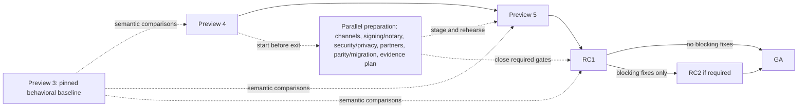

# Pre-Ignite Checkpoint Roadmap

**Status:** PROPOSAL - FOR TEAM REVIEW.  
**Objective:** GA before Ignite 2026; no exact freeze or release date is approved.

[Executive review](README.md) | [Readiness model](../v5-ga-readiness.md)

## Progression

Each table answers **what must be true to leave the checkpoint**. Feature choices
are subject to team review; checkpoint labels do not waive quality gates.
Distribution follows the decided installer/CDN, Homebrew, winget, and npm set.
APT is post-GA. MSI's role in winget remains unresolved, not a separate commitment.

### Start Versus Finish

Completion gates are not start dates. Begin the following before Preview 4 exits;
do not wait for the Preview 5 feature tranche to finish.

| Parallel work | Start / intermediate output | Required finish |
| --- | --- | --- |
| Channels and partner CI paths | Obtain actual acceptance/packaging constraints, publisher/maintainer contacts and scoped delivery plans; exercise staged artifacts in Preview 5 | Required channels and agreed CI adoption paths qualified for RC1 |
| Signing, notarization, security/privacy | Establish service/reviewer prerequisites and inspect current controls; staged artifact trust and policy evidence | Every advertised payload qualified for RC1; enabled export/privacy checks before any preview includes that behavior |
| Partners, parity and migration | Notify/intake now; collect current workflow/schema evidence and draft guidance before final scope choices | Resolve blocking adoption concerns and publish the accepted scope/alternatives before RC1 |
| Quality and release evidence | Open candidate input records and pin scenarios/fixtures now; run comparisons and rehearse staged correction paths | Green candidate record, supported matrix and executable playbooks before promotion |
| Documentation | Inventory known contradictions and source-correctness fixes now; defer only decision-dependent wording | Release-critical authoritative guidance and final-version notes before qualification |

## Preview 3: Baseline Input

Preserve the shipped tag, pinned artifacts and checksum evidence, workload/feed
settings, scenario inputs, and known limitations. Public metadata identifies
`5.0.0-preview.3`; it does not by itself prove every workload installation. Later
runs distinguish unchanged passes, expected deltas, regressions, new capabilities,
baseline limitations, and inconclusive results. Do not retroactively require new
features of this baseline.

## Preview 4: Reliability And Candidate Quality

| Lane | Required exit outcome |
| --- | --- |
| FEATURES | Existing scaffold, setup, workload/profile, and run/start paths work for the chosen candidate. Hardening is validated; no templating migration is proposed here. Updater hardening is not represented as a completed update command. |
| QUALITY | Exact candidate and baseline identities are recorded; relevant suites and changed-surface comparisons pass; bug-bash findings are classified with reproducible commands and permanent regression follow-up. |
| DISTRIBUTION | Candidate artifacts and required workloads can be acquired through the documented preview path; installation and integrity checks pass for the declared preview matrix. A public Preview 4 pin is not assumed to exist. |
| PRODUCTIZATION | Release notes, installation/feed instructions, known limitations, and bug-bash scenarios match the candidate. Start partner, security, signing, parity, and migration coordination now, not after feature completion. |
| ARCHITECTURE / DECISIONS | Agree the selected GA program, quality tracking boundaries, and supported matrix. Resolve or give an explicit deadline to each decision that blocks the next tranche. |

## Preview 5: Complete The Selected GA Tranche

| Lane | Required exit outcome |
| --- | --- |
| FEATURES | The selected feature tranche is complete, including advertised stack support. Full in-place update, enabled telemetry export and templating migration are targets only if explicitly retained. Safe manager/installer update and recovery, compatible profiles, working scaffolding and diagnostics remain required even if those features are cut. |
| QUALITY | Automated real-CLI smoke and behavioral comparisons run against Preview 3. Cover declared deltas, negative paths, local startup/invocation, cancellation, and cleanup; pinned fixtures/caches separate local-first tests from network-dependent cases. |
| DISTRIBUTION | Additional GA channels are exercised; required workload pointer/implementation versions and profile constraints are validated together. Release and rollback procedures are rehearsed. |
| PRODUCTIZATION | Parity position, migration content, security/privacy review, partner feedback, and documentation updates are converging against the retained scope with owners and acceptance evidence. |
| ARCHITECTURE / DECISIONS | Close scope-governing choices before their dependent delivery, not merely at this exit gate. Minimum migration includes all required acquisition/context/list/select/invoke prerequisites; intentional current-provider fallback has explicit supported UX. Implementation is finished here; RC1 is qualification, not a new feature tranche. |

## RC1: Could Ship As GA

| Lane | Required exit outcome |
| --- | --- |
| FEATURES | No planned major feature tranche remains. Every retained feature is complete; excluded capabilities have explicit scope and migration treatment. |
| QUALITY | Required semantic scenario and release/channel suites pass across the supported matrix; no unexplained regression or inconclusive result is counted as a pass. Startup/common-path latency has reviewed evidence and acceptance limits. |
| DISTRIBUTION | All four GA-blocking channels are operational for the declared supported platform/stack/channel cells, not an implied Cartesian product. Every downloadable payload has integrity/signing evidence; notarization and workload/profile compatibility are verified. Version or packaging changes before GA require renewed qualification. |
| PRODUCTIZATION | Security/privacy, parity/migration, accessibility, partner blocking concerns, support posture, current documentation, and executable release/rollback playbooks are sufficiently closed to ship. |
| ARCHITECTURE / DECISIONS | Release-blocking decisions are closed with recorded scope and accountable acceptance. No feature work is reserved for RC2. |

## RC2: Only If Blocking Fixes Require It

| Lane | Required exit outcome |
| --- | --- |
| FEATURES | Only RC1-blocking fixes; no new feature tranche. |
| QUALITY | Affected scenarios and full regression pass; every fix has a reproducible regression check. |
| DISTRIBUTION | Revalidate affected archives, integrity/signing, workloads/profiles, and channels against the replacement candidate. |
| PRODUCTIZATION | Update affected guidance, known issues, and release evidence; other RC1 gates remain satisfied. |
| ARCHITECTURE / DECISIONS | Explain each accepted change and its impact; another candidate does not silently broaden the GA scope. |

## GA: Publish The Validated Release

| Lane | Required exit outcome |
| --- | --- |
| FEATURES | Scope frozen; no new implementation is mixed into publication. |
| QUALITY | Final candidate evidence is green; accepted known issues and reviewed deltas are recorded. |
| DISTRIBUTION | Promote the exact qualified final-version, signed payloads and accepted channel packaging. Verify published hashes/versions and workload closure before advertisement; preserve pinned releases and roll-forward/unlist safety. A rebuild, re-sign or changed wrapper requires relevant revalidation, not inherited RC certification. |
| PRODUCTIZATION | Execute the previously prepared cutover and operational handoff. Final-version notes/migration/support guidance were validated with the artifacts; publication verification is not a new implementation or documentation-development phase. |
| ARCHITECTURE / DECISIONS | Record the human go/no-go and accepted scope; the date alone cannot satisfy a gate. |

An RC suffix and a GA version are not assumed to describe identical bytes. The
release process requires props/tag agreement and a suffix-free GA version.
Prepare and qualify the exact final GA artifacts before the publication gate;
if versioning, build inputs, signing, packages or wrappers change, reopen the
affected evidence first. Do not use a source freeze or a prior checksum as proof
that replacement artifacts were tested. No new feature implementation belongs
in that final qualification step.

## Comparison Contract

Gate stable semantics: exit codes, structured output, configuration values,
startup/invocation, error behavior, cleanup, and observable filesystem behavior.
Do not require incidental wording or byte-identical generated output unless an
explicit contract requires it. Keep Sarah's scaffolding-regression scope separate
from the broader cross-release differential contract. Pin package/profile and
fixture inputs so a changed feed or template is not mistaken for a CLI regression.
Record new capabilities and baseline limitations with candidate acceptance
evidence; never fabricate a Preview 3 pass. The existing real-process
tests are reusable evidence of an execution pattern, not proof of a completed
cross-version release harness. Use `FUNC_CLI_HOME` for isolated CLI state.
