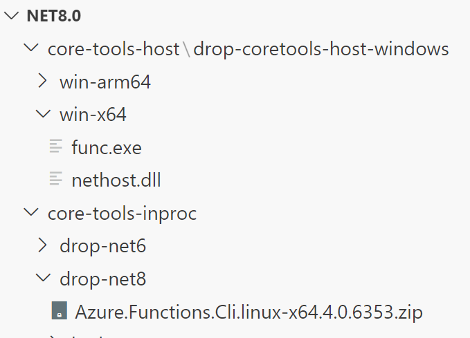

# Azure Functions Artifact Assembler

This project is designed to assemble artifacts for Azure Functions, including custom core tools hosts
and various versions of in-proc artifacts (to support .NET 6.0 and .NET 8.0 in-proc apps).
It currently packages these artifacts for Visual Studio builds, but we plan to expand to other use cases
in the future. It extracts, processes, and packages these artifacts into a format suitable for use with Visual Studio.

## Prerequisites

- .NET 8 SDK
- Visual Studio 2022 or later

## Expected Artifact Folders

The following artifact folders are expected to be present in the root directory of the executable (when debugging locally, it will be `out/bin/<project-name>/debug_net8.0`):

- A directory which contains `in-proc6` and `in-proc8` artifact directories (not zips).
- A directory which contains the core tools custom host artifact directory (not zip).

## Environment Variables

Before running the project, ensure the following environment variables are set:

- `InProcArtifactAlias`: Name of the directory which contains `in-proc6` and `in-proc8` artifacts.
- `CoreToolsHostArtifactAlias`: Name of the directory which contains the core tools host artifact.
- `InProc6ArtifactName`: Name of the in-proc6 artifact. This should match the in-proc6 directory name present in the `InProcArtifactAlias` directory.
- `InProc8ArtifactName`: Name of the in-proc8 artifact. This should match the in-proc8 directory name present in the `InProcArtifactAlias` directory.
- `CoreToolsHostArtifactName`: Name of the core tools host artifact.

You can set these environment variables in your terminal or through Visual Studio's project settings.

## Running the Project

1. Once you set the environment variables and have the sample artifacts in the output directory, you can do F5 debugging.

##### Example environment variable section in launchSettings.json:

```json
"environmentVariables": {
    "IN_PROC_ARTIFACT_ALIAS": "core-tools-inproc",
    "CORETOOLS_HOST_ARTIFACT_ALIAS": "core-tools-host",
    "IN_PROC6_ARTIFACT_NAME": "drop-net6",
    "IN_PROC8_ARTIFACT_NAME": "drop-net8",
    "CORETOOLS_HOST_ARTIFACT_NAME": "drop-coretools-host-windows"
}
```

##### Sample Artifacts in the output directory, matching the environment variables:



2. If you only want to test generating one artifact rid type (ex: win-x64), you may pass in an argument when running the assembler. The argument must be formatted as `Azure.Functions.Cli.[RID]`
```
dotnet run "$(Build.SourcesDirectory)/src/Azure.Functions.ArtifactAssembler/Azure.Functions.ArtifactAssembler.csproj -c release Azure.Functions.Cli.win-x64"
```
3. To zip up the artifacts generated that are currently in the staging directory, you may pass in a zip parameter. Ex:
```
dotnet run "$(Build.SourcesDirectory)/src/Azure.Functions.ArtifactAssembler/Azure.Functions.ArtifactAssembler.csproj -c release zip"
```
